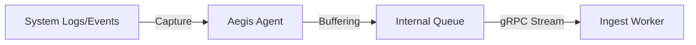

# 🦀 Agent Architecture: High-Performance Collection

The **Aegis AI Agent** is a lightweight, high-concurrency sensor written in **Rust**. It resides in the target infrastructure and provides the platform with real-time visibility and telemetry.

---

## 🏗️ Core Design Principles

The Agent is built for **speed**, **safety**, and **stealth**:

1. **Zero Garbage Collection**: Built with Rust to ensure predictable performance and no "stop-the-world" pauses during high-intensity data collection.
2. **Asynchronous Runtime**: Powered by **Tokio**, allowing the Agent to manage thousands of concurrent telemetry streams with minimal CPU overhead.
3. **Memory Safety**: Absolute protection against buffer overflows and memory corruption, which is critical for a security sensor.

---

## 🔐 Secure Communication (mTLS)

The Agent does not use standard API keys. Instead, it leverages **Mutual TLS (mTLS)** to authenticate with the Aegis Ingest layer:

- **Identity**: Every Agent is provisioned with a unique certificate signed by the Aegis Internal CA.
- **Bi-directional Trust**: The Agent verifies the Ingest server's identity, and the Ingest server verifies the Agent's identity before any data is exchanged.
- **Encrypted Channels**: All telemetry is streamed over an encrypted gRPC (HTTP/2) tunnel.

---

## 🛰️ Telemetry Pipeline

The Agent implements a multi-stage collection pipeline:

1. **Probe**: Discovers running services, network interfaces, and container metadata.
2. **Capture**: Hooks into system logs and network events.
3. **Stream**: Transparently forwards data to the `Aegis-AI-Worker-Ingest` pool using high-pressure-aware buffering.

---

## ⚙️ Resource Management

The Agent is designed to be "invisible" in terms of performance impact:

- **CPU Limit**: Typically < 5% of a single core.
- **Memory RSS**: Static baseline < 15MB.
- **Binary Size**: < 10MB (static linked).

---

_Aegis AI Infrastructure Engineering — 2026_
