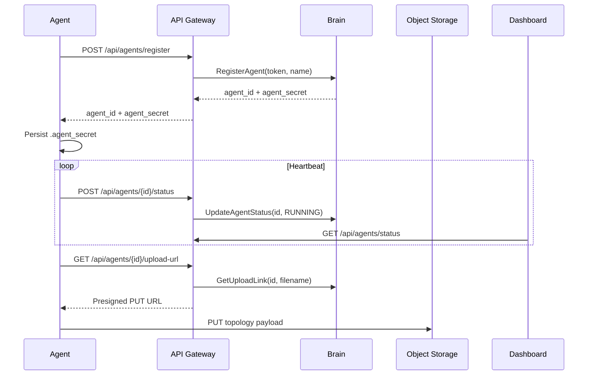

# Aegis AI Infrastructure Agent

The Aegis Agent is a Rust service deployed on customer infrastructure. It discovers local topology, registers with the API Gateway, sends periodic status updates, and uploads telemetry payloads through presigned storage URLs.

## Responsibilities

- Register once with a company deployment token.
- Persist the returned `agent_id` and `agent_secret` locally.
- Send heartbeat status updates to the Gateway.
- Collect host, process, container, and Kubernetes topology where permissions allow it.
- Upload payloads without exposing permanent storage credentials.
- Expose a local health and administration API for liveness and manual topology scans.

## Runtime Flow

## Authentication Model

The agent uses two credentials with different lifetimes:

| Credential       | Used for                           | Storage                                                    |
| ---------------- | ---------------------------------- | ---------------------------------------------------------- |
| Deployment token | First registration only            | Provided through `DEPLOYMENT_TOKEN`                        |
| Agent secret     | Heartbeats and upload URL requests | Persisted in `.agent_secret` or the configured secret file |

The deployment token format is `ag_<43+ URL-safe chars>`. Only the hash is stored server-side, and the clear token is displayed only once in the Dashboard.

## Local Agent API

The agent exposes local endpoints:

| Route                  | Method | Purpose                            |
| ---------------------- | ------ | ---------------------------------- |
| `/health`              | `GET`  | Liveness and readiness probe       |
| `/admin/system/health` | `GET`  | Administrative health check        |
| `/admin/system/scan`   | `POST` | Trigger a topology scan and upload |

The health server binds to localhost by default. Do not expose it publicly.
