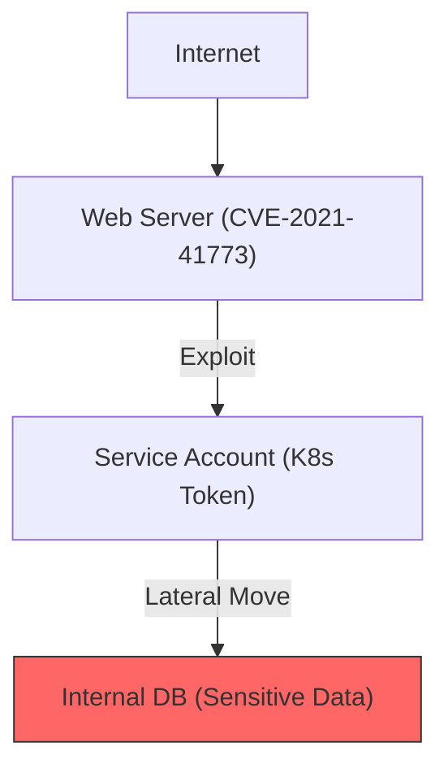

# Vulnerability Graph Analysis (Neo4j)

Aegis AI goes beyond simple tabular reporting by using **Neo4j Graph Databases** to model the complex relationships between discovered assets, vulnerabilities, and potential attack paths.

## Why a Graph?

Traditional security scanners treat vulnerabilities as isolated incidents. Aegis AI treats them as **Nodes** in a wider ecosystem. This allows the platform to:

- **Discover Attack Chains**: Identifying how a Low-severity vulnerability on Server A can be combined with a Medium-severity flaw on Server B to achieve full Domain Admin privileges.
- **Surface Lateral Movement Paths**: Visualizing how an attacker can hop from a public web server into the internal CI/CD network.
- **Prioritize Fixes with Impact Analysis**: Calculating which single vulnerability, if fixed, would break the most high-criticality attack paths.

## Domain Model (Graph Schema)

The database models the following entities as nodes:

- **`Mission`**: The root container for a security operation.
- **`Target`**: A specific IP, hostname, or Docker image.
- **`Vulnerability`**: A technical weakness (CVE, misconfiguration).
- **`Evidence`**: Proof of exploitation connecting a vulnerability to its impact.
- **`Identity`**: Captured credentials or service tokens.

### Relationship Types

- `(:Target)-[:EXPOSED]->(:Vulnerability)`
- `(:Vulnerability)-[:PROVIDES_ACCESS_TO]->(:Identity)`
- `(:Identity)-[:CAN_AUTHENTICATE_TO]->(:Target)`

## Platform Integration

### 1. Ingestion

The **Brain** service translates relational SQL data into Cypher queries to populate the Neo4j instance during the `ANALYZING` phase of a scan.

### 2. Analysis (Pathfinding)

The platform executes Graph Data Science (GDS) algorithms, such as **Shortest Path** or **PageRank**, to identify the most likely path an adversary would take to reach "The Crown Jewels" (e.g., the production database).

### 3. Visualization

Operators can explore the graph directly through the **Aegis AI Dashboard**, providing a "God's Eye View" of the organization's risk surface.

