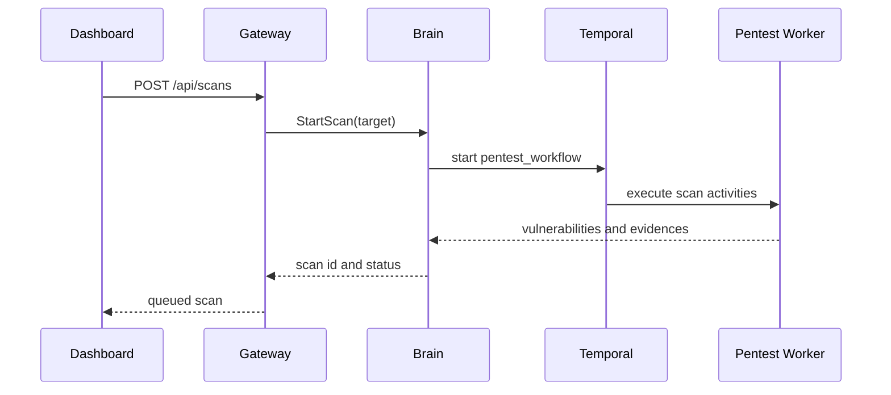

# Brain Workflows

Brain is the orchestration service behind the Gateway. It exposes gRPC services for authentication, companies, billing, agents, scans, vulnerabilities, and internal health checks.

## Responsibilities

- Validate user credentials and issue JWT/refresh tokens.
- Enforce tenant visibility and role-based access.
- Persist companies, users, scans, vulnerabilities, evidences, audit logs, billing ledgers, and agent records.
- Start and monitor pentest workflows.
- Register agents and track their heartbeat status.
- Generate report and storage links for downstream services.

## Scan Workflow

## Agent Workflow

Agent registration and status are handled by Brain through the AgentService:

1. Validate the deployment token hash.
2. Create an agent record bound to a company.
3. Return an `agent_id` and `agent_secret`.
4. Accept heartbeat updates signed with the agent secret.
5. Expose summary counts to the Dashboard.

## Failure Handling

- gRPC methods return explicit status codes for invalid credentials, not found resources, and permission failures.
- Temporal activities should be idempotent so retries do not duplicate tenant data.
- Audit logs are written for sensitive administrative and token-management actions.
