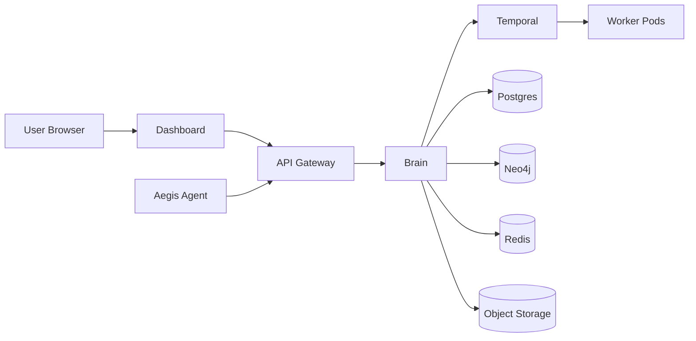

# Infrastructure Architecture

Aegis runs as a set of services on Kubernetes. Public traffic reaches the Dashboard and Gateway, while backend services communicate through internal service endpoints and gRPC.

## Core Components

| Component   | Role                                           |
| ----------- | ---------------------------------------------- |
| Dashboard   | Browser UI                                     |
| API Gateway | REST/SSE edge and policy layer                 |
| Brain       | gRPC business service and orchestration        |
| Agent       | Customer-side infrastructure probe             |
| Workers     | Scan, ingest, deploy, or remediation execution |
| Redis       | cache, rate limiting, transient state          |
| Neo4j       | topology and relationship graph                |
| Temporal    | workflow orchestration                         |

## Operating Principles

- Keep public ingress limited to Dashboard, Gateway, and documented health endpoints.
- Keep tenant identity attached to every backend operation.
- Use secrets and config maps instead of hard-coded credentials.
- Treat workers as isolated and replaceable execution units.
