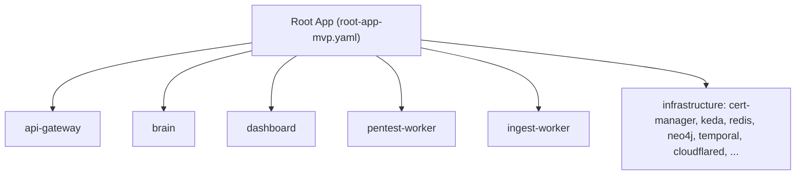

# GitOps & Argo CD

The Aegis cluster is deployed with **GitOps**: Argo CD continuously reconciles the
cluster to the state declared in `Aegis-AI-Infra`. Any change merged to the
tracked ref is synchronized automatically.

## App-of-Apps

A single **root application** owns the environment and creates one child
application per service and per shared infrastructure component.



## Repository layout

```text
kubernetes/
  bootstrap/
    root-app-mvp.yaml        # Argo CD root application for the MVP environment
  charts/
    aegis-service/           # Universal Helm chart used by every service
  envs/
    mvp/
      api-gateway/           # application.yaml + values.yaml
      brain/
      dashboard/
      pentest-worker/
      ingest-worker/
      infrastructure/
        cert-manager/        # Automated TLS / mTLS
        keda/                # Event-driven autoscaling
        ...
scripts/
  setup-env.sh               # Bootstraps a full environment
  generate-brain-certs.sh    # mTLS certificate generation
  teardown-env.sh            # Cluster cleanup
```

Each service folder holds an Argo CD `application.yaml` and a `values.yaml`.
Runtime configuration lives in `values.yaml` and Kubernetes secrets — never in
Git.

## Tech stack

| Component       | Technology               | Version                |
| --------------- | ------------------------ | ---------------------- |
| Orchestration   | Kubernetes               | 1.28+                  |
| GitOps          | Argo CD                  | stable                 |
| Autoscaling     | KEDA                     | 2.x                    |
| Certificates    | cert-manager             | 1.x                    |
| Ingress         | Nginx Ingress Controller | —                      |
| Workflow engine | Temporal                 | Helm 0.x               |
| Database        | PostgreSQL (Bitnami)     | 16                     |
| Sandbox runtime | gVisor (`runsc`)         | `sandbox-*` namespaces |

## Bootstrap the MVP environment

```bash
# From the Aegis-AI-Infra repository root
./scripts/setup-env.sh mvp

# Access the Argo CD UI
kubectl port-forward svc/argocd-server -n argocd 8080:443
# → https://localhost:8080  (user: admin)

# Retrieve the initial admin password
kubectl -n argocd get secret argocd-initial-admin-secret \
  -o jsonpath="{.data.password}" | base64 -d && echo
```

Public HTTPS access to the MVP is routed through a **Cloudflare Tunnel**
(`cloudflared`) into the in-cluster reverse proxy, then to the Nginx ingress.

## Common operations

```bash
kubectl get applications -n argocd
kubectl get pods -n aegis-system
kubectl logs -n aegis-system deploy/aegis-api-gateway
```

## Operating rules

- Git is the source of truth; do not `kubectl apply` changes by hand in
  environments Argo CD manages.
- Keep secrets in Kubernetes secrets, populated by `scripts/setup-env.sh` from a
  local `.env`, not committed.
- Prefer additive changes to `values.yaml`; review breaking changes across
  dependent services.
