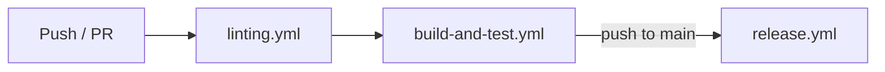
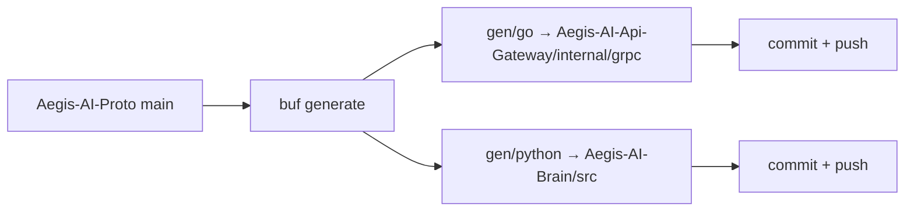
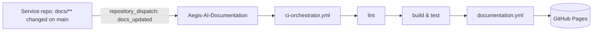

# CI/CD Pipeline

Every Aegis repository runs the same reusable-workflow pipeline on GitHub Actions.
Deployment to Kubernetes is not done by CI directly — CI publishes artifacts and
Argo CD reconciles the cluster from Git (see [GitOps & Argo CD](../Infra/gitops-argocd.md)).

## Per-repository pipeline

`ci-orchestrator.yml` chains three reusable workflows:

| Stage        | Workflow             | Runs on             | Purpose                                          |
| ------------ | -------------------- | ------------------- | ------------------------------------------------ |
| Lint         | `linting.yml`        | every push / PR     | Language linters, formatting, `pre-commit` hooks |
| Build & Test | `build-and-test.yml` | after lint          | Compile, unit/integration tests, coverage        |
| Release      | `release.yml`        | push to `main` only | Build and publish the container image / artifact |

Runners are ephemeral and tokens are narrowly scoped (`contents`, `packages`,
`pages`, `id-token` as needed).

## Contract sync — `proto-sync.yml`

`Aegis-AI-Proto` owns every gRPC contract. On push to `main` (or `dev`):

- `buf generate` produces Go and Python stubs.
- The workflow clones `Aegis-AI-Api-Gateway` and `Aegis-AI-Brain`, copies the
  generated code in, runs each repo's `pre-commit` hooks on the changed files
  (skipping `golangci-lint` on generated Go), and commits
  `[UPDATE] gRPC code sync from Aegis-AI-Proto` if anything changed.
- The Python `_pb2.py` files have their `ValidateProtobufRuntimeVersion` block
  stripped for cross-runtime compatibility.

## Documentation sync — `docs-sync.yml`

Each service repo watches `docs/**` and `README.md` on `main`:

- A `peter-evans/repository-dispatch` step fires the `docs_updated` event at
  `Aegis-AI-Documentation` using an org PAT.
- The Documentation `ci-orchestrator.yml` also runs on its own pushes to `main`.
- `documentation.yml` runs `npm ci`, `npm run gen-api-docs`, `npm run build`
  (which performs the remote-content fetches), then deploys `./build` to
  **GitHub Pages** with `contents: read`, `pages: write`, `id-token: write`.

## Handoff to deployment

Release images land in the container registry. `Aegis-AI-Infra` references image
tags in per-service `values.yaml`; **Argo CD** (App-of-Apps) syncs the cluster to
that Git state. There is no `kubectl apply` from CI.

## Shared automation — `aegis-automation.yml`

Present in every repo for org-wide maintenance tasks (branch alignment, metadata,
housekeeping). It is orthogonal to the build/test/release path above.
