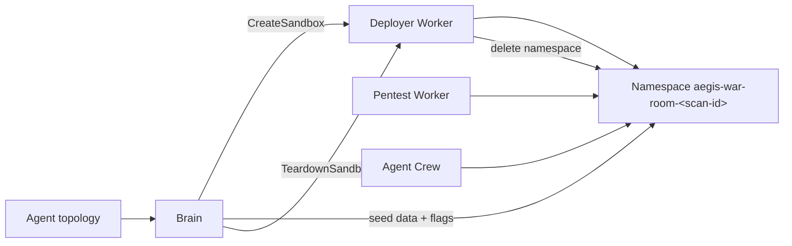

# Digital Twin & Test Targets

Aegis never runs offensive traffic against customer production. Every scan targets
a **digital twin**: an isolated, disposable replica built from the topology the
agent discovered.

## Why a twin

- Exploitation, loot extraction, and LLM-driven payloads carry risk. Running them
  against a replica removes blast-radius concerns.
- The twin is reproducible, so a scan can be re-run and compared.
- The twin is cheap to destroy, so each scan starts clean.

## Lifecycle

1. **Build** — the [Deployer Worker](../Worker-Deployer/quickstart.md) renders
   workloads, services, default-deny egress, and external mock DNS/HTTP services
   into `aegis-war-room-<scan-id>`.
2. **Seed** — Brain populates databases with realistic data and known flags
   (e.g. `aegis-flag-1234`) so exfiltration can be proven.
3. **Attack** — the [Pentest Worker](../Worker-Pentest/architecture.md) and the
   [Agent Crew](../Agent-Crew/architecture.md) probe only endpoints inside that
   namespace.
4. **Teardown** — the namespace is deleted; the Deployer refuses to delete
   anything not prefixed `aegis-war-room-`.

## `vuln-app` — the canonical vulnerable fixture

The `vuln-app` repository is a minimal deliberately vulnerable Flask app
(`python:3.9-slim`, listens on port `80`) used to validate the whole pentest
pipeline end to end. It is **test-only** and must never be exposed publicly.

| Route      | Method | Behavior                                                                                                                                                                             |
| ---------- | ------ | ------------------------------------------------------------------------------------------------------------------------------------------------------------------------------------ |
| `/`        | `GET`  | Static banner (`Vulnerable Mock App`).                                                                                                                                               |
| `/search`  | `GET`  | **SQL-injection stand-in.** If `q` contains a quote, it returns the full mock user table (`results`, `count`, `status: success`) — a deterministic signal the scanner can assert on. |
| `/reflect` | `GET`  | **Reflected XSS.** Echoes `q` straight into the HTML body with no escaping.                                                                                                          |
| `/health`  | `GET`  | `{"status": "ok"}` readiness probe.                                                                                                                                                  |

The mock user table contains fake `admin` / `user` rows with MD5 password hashes,
so a successful "exploit" yields verifiable loot without any real secret.

## Relationship to the Deployer fixtures

The Deployer repository ships a richer fixture
(`examples/sandbox-topology.vulnerable-webapp.json`) that wires a vulnerable web
app to a PostgreSQL StatefulSet with dependency ordering and an external payment
mock. `vuln-app` is the lightweight variant for fast local checks; the Deployer
fixture is the closer-to-real sandbox shape. See
[Deployer · Quickstart](../Worker-Deployer/quickstart.md).
