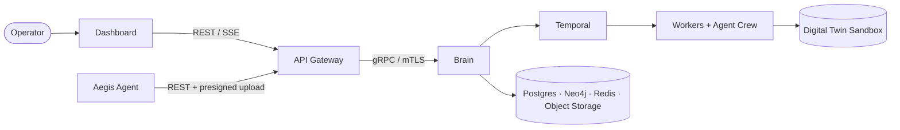

# Aegis AI — Introduction

Aegis AI is an **offensive security control plane**: a platform that continuously
maps a customer's infrastructure, runs automated, LLM-assisted penetration tests
against a safe replica of that infrastructure, and turns confirmed findings into
remediation proposals.

The platform is built as a set of specialized microservices that communicate over
gRPC and a single REST/SSE edge. This portal is the architectural source of truth
for all of them.

## The problem

Traditional penetration testing is periodic, manual, and expensive. Between two
engagements, infrastructure drifts: new services are exposed, dependencies age,
and configuration changes. Aegis AI targets that gap with a system that:

- keeps a live model of the customer topology through a lightweight agent;
- launches reproducible pentest workflows on demand or on a schedule;
- combines deterministic vulnerability checks with LLM-driven payload generation;
- runs every offensive action against an **isolated digital twin**, never the
  production system;
- produces evidence-backed reports and remediation patches.

## How it works, in one paragraph

A customer organization is onboarded and receives a one-time **deployment token**.
An **Agent** (Rust) is installed on their infrastructure; it registers through the
**API Gateway** (Go), then streams topology and heartbeats. From the **Dashboard**
(React), an operator starts a scan. The **Brain** (Python) orchestrates the scan as
a durable **Temporal** workflow: it asks the **Deployer Worker** to build a sandbox
replica, runs the **Pentest Worker** and the **Agent Crew** (CrewAI) against it,
persists vulnerabilities and evidence, stores a topology graph in **Neo4j**, and
generates a PDF report. Confirmed findings can be handed to the **Fixer Worker**
for remediation proposals. Everything is scoped to the customer's tenant and
metered through a token ledger.

## Project context

Aegis AI is an **Epitech Innovative Project (EIP)**, identified as `AEGIS-CORE-2026`.
It is developed as a polyglot, multi-repository system (Go, Python, Rust,
TypeScript) deployed on Kubernetes with a GitOps pipeline.

## Where to go next

| You want to…                                   | Read                                                   |
| ---------------------------------------------- | ------------------------------------------------------ |
| Understand the full component map              | [System Architecture](./system-architecture.md)       |
| Follow a scan from click to report             | [End-to-End Lifecycle](./lifecycle.md)                 |
| Know which repository does what                | [Repositories](./repositories.md)                      |
| Understand the trust and isolation model       | [Security Model](./security-model.md)                  |
| Look up a term                                 | [Glossary](./glossary.md)                              |
| Check what is implemented today                | [Project Status](./project-status.md)                  |
| Deploy the platform                            | [Infrastructure · Getting Started](../Infra/getting-started.md) |
| Call the public API                            | [API Reference](../Swagger-API/aegis-ai-gateway-api.info.mdx)   |
