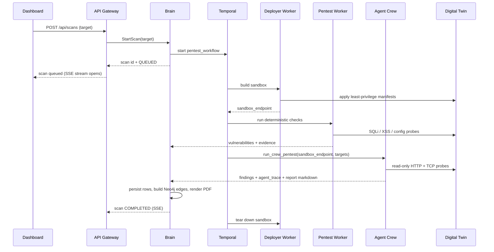

# End-to-End Lifecycle

This page follows one customer from onboarding to a remediated vulnerability, and
names the service responsible for each step.

## 1. Company onboarding

1. An Aegis admin (or the post-payment onboarding flow) creates the company,
   its owner user, and a one-time **deployment token** — atomically, in Brain.
2. The owner receives an invitation and activates the account through
   `POST /api/auth/setup-password`. The response returns the clear deployment
   token **once**; only its SHA-256 hash is stored.
3. Brain writes an audit-log entry for the creation.

## 2. Agent deployment

1. The owner installs the **Aegis Agent** (Docker, systemd, or Helm DaemonSet)
   with `DEPLOYMENT_TOKEN` set.
2. On first boot the agent calls `POST /api/agents/register`. The Gateway forwards
   `RegisterAgent(token, name)` to Brain, which validates the token hash, creates
   an `Agent` row bound to the company, and returns `agent_id` + `agent_secret`.
3. The agent persists the secret locally and from then on authenticates with it.
4. The agent sends `RUNNING` heartbeats to `POST /api/agents/{id}/status`; Brain
   updates `last_seen`. The Dashboard reads `GET /api/agents/status` for the
   active/inactive summary.

## 3. Topology collection

1. The agent inspects host, process, container, and Kubernetes inventory where
   permissions allow.
2. It requests a presigned URL from `GET /api/agents/{id}/upload-url` and `PUT`s
   the topology payload to object storage — no permanent storage credentials.
3. The **Ingest Worker** normalizes payloads into backend records; Brain projects
   the topology into the **Neo4j** graph.

## 4. Scan orchestration

Key points:

- The workflow is **durable**: Temporal replays it across pod restarts, so a
  crashed worker does not lose scan state.
- Activities are **idempotent** so retries never duplicate tenant data.
- The **Agent Crew** runs three Ollama-backed agents — `Planner` (llama3.1:8b),
  `Guider` (whiterabbitneo), `Executor` (deepseek-coder-v2) — and is
  **non-destructive in V1**: it validates `constraints` and fails before any
  model call if destructive behavior is requested.
- Offensive traffic reaches only the **Deployer-built digital twin**, never
  customer production.

## 5. Results and reporting

1. Brain stores `Scan`, `Vulnerability`, and `Evidence` rows (loot in JSONB).
2. It links assets and findings in Neo4j for attack-path and impact analysis.
3. It renders a PDF report and exposes it through
   `GET /api/scans/{id}/report`.
4. The Dashboard streams live status via `GET /api/scans/{id}/stream` and lists
   findings in the Vulnerability Vault.

## 6. Remediation

1. A confirmed finding plus context is handed to the **Fixer Worker**.
2. The Fixer produces a **patch proposal**, preferring pull-request-style changes
   over direct mutation, and records actor, tenant, finding, and generated change.
3. Nothing is applied automatically; approval stays with the operator through the
   Dashboard.

## 7. Metering and audit

- Token-consuming operations are debited from the company balance and written to
  the **billing ledger** (`GET /api/billing/ledger`, `/balance`, `/stats`).
- Sensitive administrative and token-management actions produce **audit-log**
  entries (`GET /api/admin/audit-logs`).
