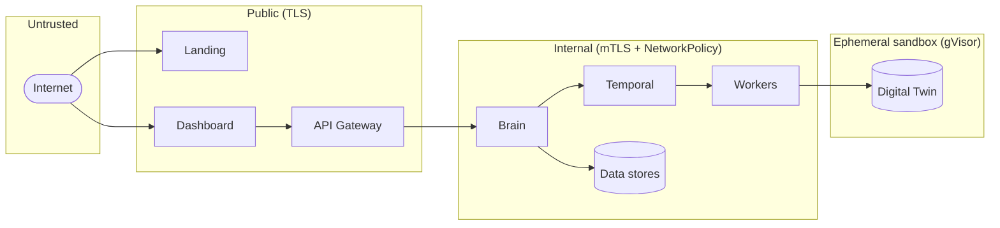

# Security Model

Security controls in Aegis AI are layered. No single control is trusted on its own;
each one assumes the others may fail.

## Trust boundaries

## Identity and authentication

| Actor            | Credential                        | Lifetime / handling                                                  |
| ---------------- | -------------------------------- | ------------------------------------------------------------------- |
| Operator (user)  | JWT access token                 | Short-lived, kept in memory in the frontend.                         |
| Operator session | Refresh token                    | HTTP-only cookie, rotated on every refresh, revocable server-side.   |
| Agent (register) | Deployment token `ag_<43+ chars>`| One-time, per company; only the SHA-256 hash is stored.              |
| Agent (runtime)  | Agent secret                     | Per agent; bcrypt-hashed server-side; returned once at registration. |
| Gateway → Brain  | mTLS client certificate          | Mounted from Kubernetes secrets under `/etc/brain/certs`.            |
| Internal token   | `InternalAuthService` verification| gRPC interceptor whitelist for machine-to-machine checks.            |

Rotating or revoking a deployment token does **not** disconnect already-registered
agents — they keep using their own agent secret.

## Authorization (RBAC)

Roles are synchronized between Brain and the Gateway:

| Role             | Side     | Typical scope                         |
| ---------------- | -------- | ------------------------------------ |
| `superadmin`     | Platform | Platform-wide administration          |
| `admin`          | Platform | Aegis-side administration             |
| `billing_aegis`  | Platform | Platform billing operations           |
| `technicien`     | Platform | Technical support operations          |
| `support`        | Platform | Support and customer assistance       |
| `commercial`     | Platform | Commercial / account operations       |
| `owner`          | Customer | Customer organization owner           |
| `billing_client` | Customer | Customer billing access               |
| `operateur`      | Customer | Customer technical operator           |
| `viewer`         | Customer | Read-only customer access             |

Customer roles can never read another company's scans or agents; elevated
platform routes require explicit elevated scopes.

## Multi-tenancy

- Every tenant-owned resource carries a `company_id`: users, agents and tokens,
  scans, vulnerabilities, evidences, reports, billing entries, audit logs.
- Brain re-applies tenant filters on every read and mutation, even though the
  Gateway already authenticated the caller.
- Neo4j queries that materialize graph data for the UI, reports, or workers are
  constrained by company context.

## Network and runtime isolation

- **Default-deny** network policies where practical; worker namespaces cannot
  reach unrelated platform services; databases accept only expected workloads.
- Workers run **non-root**, read-only root filesystem where possible, dropped
  Linux capabilities, resource limits, restricted service accounts.
- Security workers can run under the **gVisor (`runsc`)** runtime class in
  `sandbox-*` namespaces.
- Public HTTPS is fronted by Nginx ingress; production external access is routed
  through a Cloudflare Tunnel.

## Offensive-action safety

- Offensive traffic only ever targets a **Deployer-provisioned digital twin**,
  never customer production.
- The Agent Crew is **non-destructive in V1**: allowed actions are read-only HTTP
  (`GET`/`HEAD`/`OPTIONS`), TCP reachability probes, header/response analysis, and
  patch-text generation. Mutating the sandbox, executing commands in target pods,
  writing Kubernetes resources, applying patches, and pushing Git changes are
  forbidden; the worker fails before any model call if `constraints` request them.
- A vulnerability is only marked **confirmed** after deterministic validation, not
  on model claims. Evidence comes from the worker, not the model.

## Secrets and data handling

- Secrets and config come from Kubernetes secrets / config maps, never Git.
- Deployment tokens and agent secrets are never included in telemetry payloads.
- Secrets, customer credentials, tokens, and raw private data are never sent to
  external model providers; prompt context is limited to sanitized technical
  metadata.
- Evidence is sanitized before it is rendered in reports or the UI.

## Auditability

Sensitive administrative and token-management actions write audit entries that
include actor and company context, available through `GET /api/admin/audit-logs`.
