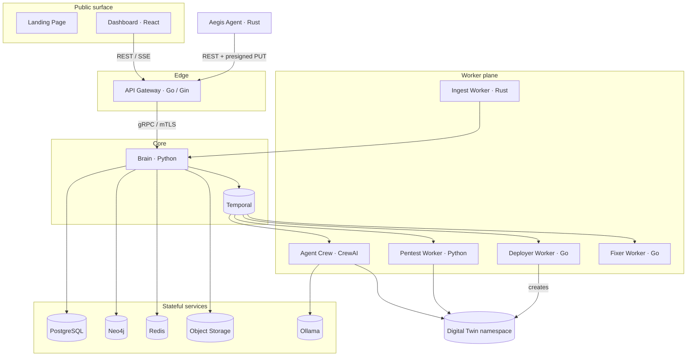

# System Architecture

Aegis AI is an event-driven microservices platform on Kubernetes. Public traffic
enters through a single edge (Dashboard + API Gateway). All business logic lives in
the Brain, which orchestrates workers through Temporal. Every internal hop is
authenticated.

## Components

| Component        | Language / Stack        | Role                                                                                       |
| ---------------- | ----------------------- | ----------------------------------------------------------------------------------------- |
| Landing Page     | Next.js                 | Public marketing site. No access to authenticated state.                                   |
| Dashboard        | React 18 + Vite + Panda | Operator console: agents, scans, vulnerabilities, reports, billing, admin.                 |
| API Gateway      | Go 1.22 + Gin           | REST/SSE edge, CORS, rate limiting, JWT + agent-auth middleware, REST↔gRPC translation.    |
| Brain            | Python 3.11 + asyncio   | gRPC business service, Temporal workflow engine, persistence, report generation.           |
| Proto            | Protobuf + buf          | Single source of truth for all gRPC contracts; generates Go, Python and Rust stubs.        |
| Aegis Agent      | Rust                    | Customer-side probe: registers, heartbeats, discovers topology, uploads via presigned URL. |
| Deployer Worker  | Go                      | Builds and tears down the isolated digital-twin sandbox for a scan.                        |
| Pentest Worker   | Python + Scapy          | Deterministic vulnerability checks (SQLi, XSS, …) and evidence capture.                    |
| Agent Crew       | Python + CrewAI         | Temporal worker coordinating `Planner`, `Guider`, `Executor` LLM agents (Ollama).          |
| Ingest Worker    | Rust                    | Normalizes agent telemetry batches into backend records.                                   |
| Fixer Worker     | Go                      | Turns confirmed findings into remediation proposals (PR-style, non-destructive).           |
| Infra            | Kubernetes + Argo CD    | GitOps manifests, `aegis-service` Helm chart, network policies, cert-manager, KEDA.        |

## Communication patterns

| From → To                     | Protocol                       | Notes                                                        |
| ----------------------------- | ------------------------------ | ----------------------------------------------------------- |
| Browser → Gateway             | HTTPS REST + SSE               | JWT access token; refresh via HTTP-only cookie.              |
| Agent → Gateway               | HTTPS REST + presigned `PUT`   | Deployment token for registration, agent secret afterwards.  |
| Gateway → Brain               | gRPC over mTLS                 | Client cert validated; tenant identity in gRPC metadata.     |
| Brain → Temporal              | Temporal SDK                   | Durable workflows survive pod restarts.                      |
| Temporal → Workers            | Task queues                    | One queue per worker class (e.g. `CREWAI_TASK_QUEUE`).       |
| Brain → PostgreSQL            | SQLAlchemy 2.0                 | All tenant-owned relational data.                            |
| Brain → Neo4j                 | Bolt                           | Topology and attack-path graph.                              |
| Brain → Redis                 | RESP                           | Cache, rate limiting, transient state, SSE fan-out.          |
| Brain / Agent → Object Store  | S3-compatible (MinIO in dev)   | Reports, loot, topology payloads.                            |
| Agent Crew → Ollama           | HTTP                           | In-cluster ClusterIP; models never bundled in images.       |

## Data stores

| Store            | Holds                                                                    |
| ---------------- | ---------------------------------------------------------------------- |
| PostgreSQL       | companies, users, refresh tokens, agents, scans, vulnerabilities, evidences, billing ledger, audit logs |
| Neo4j            | hosts, containers, services, images, namespaces, vulnerabilities, evidences and their relationships     |
| Redis            | caches, rate-limit counters, SSE broadcaster state                       |
| Object storage   | PDF reports, evidence/loot payloads, agent topology uploads              |

## Operating principles

- Public ingress is limited to the Landing Page, Dashboard, API Gateway, and
  documented health endpoints.
- Tenant identity (`company_id`) is attached to every backend operation and
  re-checked in Brain even when the Gateway already authenticated the request.
- Business logic stays in Brain; the Gateway stays thin and policy-focused.
- Workers are stateless, isolated, and replaceable; they only receive work through
  backend orchestration.
- Offensive traffic only ever targets a Deployer-provisioned digital twin.
- Configuration and secrets come from Kubernetes secrets / config maps, never Git.
