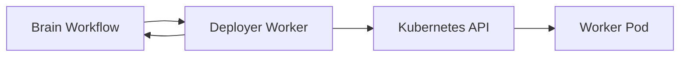

# Deployer Worker Architecture

The Deployer Worker provisions controlled worker or sandbox resources for Aegis workflows. It is a backend component and should be driven by Brain orchestration.

## Responsibilities

- Create isolated execution resources.
- Apply least-privilege Kubernetes manifests.
- Report deployment status back to the orchestrator.
- Clean up temporary resources after workflow completion.

## Kubernetes Boundary

The deployer must run with narrowly scoped RBAC. It should not have unrestricted cluster-admin permissions in production environments.

## Flow

## Failure Handling

- Resource creation should be idempotent.
- Cleanup should tolerate missing resources.
- Status updates must distinguish pending, ready, failed, and deleted resources.
