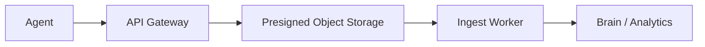

# Ingest Worker Architecture

The Ingest Worker is the telemetry ingestion component. In the current platform flow, agents request Gateway-issued upload URLs and object storage receives payloads; the ingest worker can be used to process and normalize incoming telemetry streams or batches.

## Responsibilities

- Accept or process telemetry payloads from agent infrastructure.
- Normalize events into backend-friendly records.
- Preserve tenant context from trusted metadata.
- Forward processed telemetry to storage, queues, or analytical backends.

## Design Constraints

- Do not trust tenant identity from unsigned payload content.
- Validate payload size and schema before processing.
- Keep ingestion idempotent so retries do not duplicate data.
- Separate raw payload storage from normalized event storage.

## Data Flow

