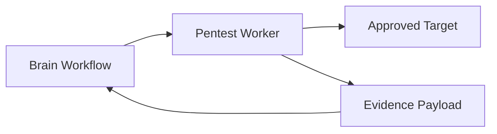

# Pentest Worker Architecture

The Pentest Worker executes scan tasks against approved targets and returns findings to Brain. It is intentionally isolated from Dashboard users and receives work only through backend orchestration.

## Responsibilities

- Execute supported vulnerability checks.
- Capture technical evidence.
- Return structured findings for Brain persistence.
- Keep scan execution stateless and repeatable.
- Run with restricted network and filesystem access in Kubernetes.

## Current Scope

The worker repository contains Python checks for common web vulnerabilities, including SQL injection and XSS test paths used by the platform MVP.

## Execution Flow

## Security Rules

- Workers must only scan targets authorized by the scan workflow.
- Offensive traffic should run from isolated worker pods.
- Evidence must be sanitized before it is rendered in reports or UI.
- Secrets from the platform must not be written into scan artifacts.
