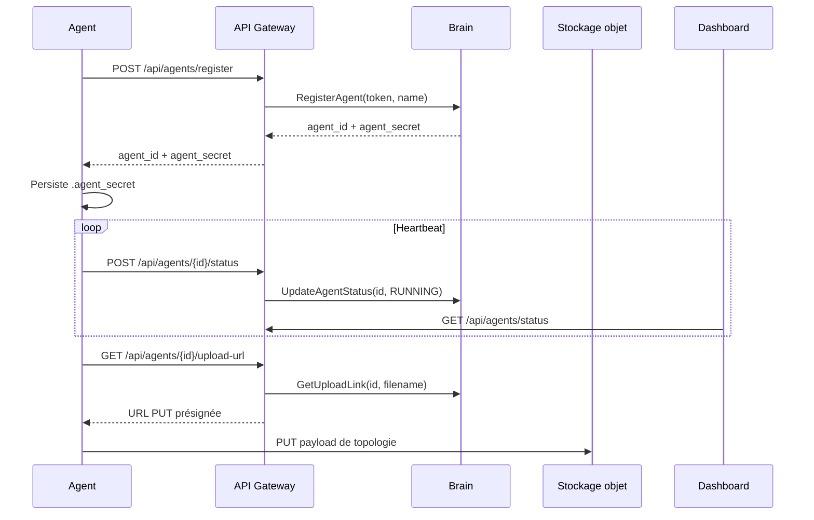

# Agent d'infrastructure Aegis AI

L'agent Aegis est un service Rust déployé dans l'infrastructure cliente. Il découvre la topologie locale, s'enregistre auprès de l'API Gateway, envoie des statuts périodiques et téléverse ses payloads de télémétrie via des URL de stockage présignées.

## Responsabilités

- S'enregistrer une seule fois avec le token de déploiement d'une entreprise.
- Persister localement le `agent_id` et le `agent_secret` retournés.
- Envoyer des heartbeats à la Gateway.
- Collecter la topologie hôte, processus, conteneurs et Kubernetes lorsque les permissions le permettent.
- Téléverser des payloads sans exposer d'identifiants de stockage permanents.
- Exposer une API locale de santé et d'administration pour les probes et les scans manuels.

## Flux d'exécution

## Modèle d'authentification

L'agent utilise deux identifiants avec des durées de vie différentes :

| Identifiant          | Utilisation                           | Stockage                                                   |
| -------------------- | ------------------------------------- | ---------------------------------------------------------- |
| Token de déploiement | Premier enregistrement uniquement     | Fourni via `DEPLOYMENT_TOKEN`                              |
| Secret agent         | Heartbeats et demandes d'URL d'upload | Persisté dans `.agent_secret` ou dans le fichier configuré |

Le token de déploiement suit le format `ag_<43+ caractères URL-safe>`. Seul son hash est stocké côté serveur, et le token en clair n'est affiché qu'une seule fois dans le Dashboard.

## API locale de l'agent

L'agent expose des endpoints locaux :

| Route                  | Méthode | Usage                                        |
| ---------------------- | ------- | -------------------------------------------- |
| `/health`              | `GET`   | Probe de disponibilité                       |
| `/admin/system/health` | `GET`   | Vérification de santé administrative         |
| `/admin/system/scan`   | `POST`  | Déclenche un scan de topologie et son upload |

Le serveur de santé écoute sur localhost par défaut. Ne l'exposez pas publiquement.
