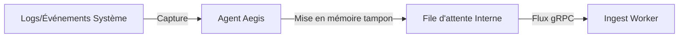

# 🦀 Architecture de l'Agent : Collecte Haute Performance

L'**Agent Aegis AI** est un capteur léger et à haute concurrence écrit en **Rust**. Il réside dans l'infrastructure cible et fournit à la plateforme une visibilité et une télémétrie en temps réel.

---

## 🏗️ Principes de Conception de Base

L'Agent est conçu pour la **vitesse**, la **sécurité** et la **discrétion** :

1. **Zéro Ramasse-miettes (Garbage Collection)** : Construit avec Rust pour garantir des performances prévisibles et aucune pause "stop-the-world" pendant la collecte de données à haute intensité.
2. **Runtime Asynchrone** : Propulsé par **Tokio**, permettant à l'Agent de gérer des milliers de flux de télémétrie simultanés avec une surcharge CPU minimale.
3. **Sécurité de la Mémoire** : Protection absolue contre les dépassements de tampon et la corruption de mémoire, ce qui est critique pour un capteur de sécurité.

---

## 🔐 Communication Sécurisée (mTLS)

L'Agent n'utilise pas de clés API standard. Au lieu de cela, il exploite le **Mutual TLS (mTLS)** pour s'authentifier auprès de la couche Ingest d'Aegis :

- **Identité** : Chaque Agent est provisionné avec un certificat unique signé par la CA Interne d'Aegis.
- **Confiance Bidirectionnelle** : L'Agent vérifie l'identité du serveur Ingest, et le serveur Ingest vérifie l'identité de l'Agent avant tout échange de données.
- **Canaux Chiffrés** : Toute la télémétrie est transmise via un tunnel gRPC (HTTP/2) chiffré.

---

## 🛰️ Pipeline de Télémétrie

L'Agent implémente un pipeline de collecte à plusieurs étapes :

1. **Sonde (Probe)** : Découvre les services en cours d'exécution, les interfaces réseau et les métadonnées des conteneurs.
2. **Capture** : Se branche sur les journaux système et les événements réseau.
3. **Flux (Stream)** : Transmet de manière transparente les données au pool `Aegis-AI-Worker-Ingest` en utilisant une mise en mémoire tampon sensible à la contre-pression.

---

## ⚙️ Gestion des Ressources

L'Agent est conçu pour être "invisible" en termes d'impact sur les performances :

- **Limite CPU** : Généralement < 5% d'un seul cœur.
- **Mémoire RSS** : Base statique < 15 Mo.
- **Taille du binaire** : < 10 Mo (lié statiquement).

---

_Ingénierie Infrastructure Aegis AI — 2026_
