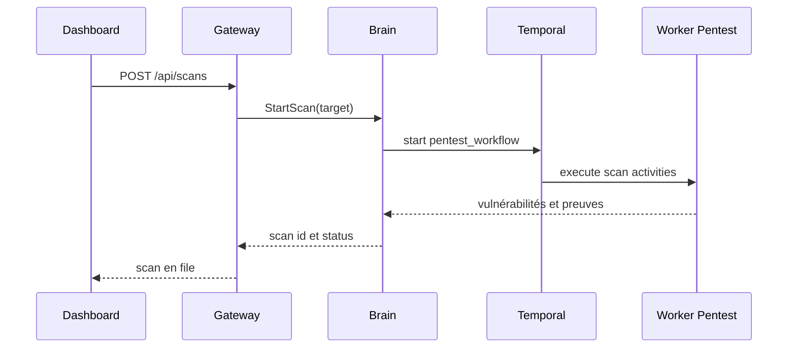

# Workflows Brain

Brain est le service d'orchestration derrière la Gateway. Il expose les services gRPC d'authentification, entreprises, facturation, agents, scans, vulnérabilités et santé interne.

## Responsabilités

- Valider les identifiants et émettre JWT/refresh tokens.
- Appliquer la visibilité tenant et les rôles.
- Persister entreprises, utilisateurs, scans, vulnérabilités, preuves, audit logs, ledger et agents.
- Démarrer et suivre les workflows de pentest.
- Enregistrer les agents et suivre leurs heartbeats.
- Générer les liens de rapport et de stockage.

## Workflow scan

## Workflow agent

1. Valider le hash du token de déploiement.
2. Créer un agent lié à une entreprise.
3. Retourner `agent_id` et `agent_secret`.
4. Accepter les heartbeats signés avec le secret agent.
5. Exposer les compteurs au Dashboard.

## Gestion des erreurs

Les méthodes gRPC doivent retourner des codes explicites pour les identifiants invalides, ressources absentes et permissions insuffisantes.
