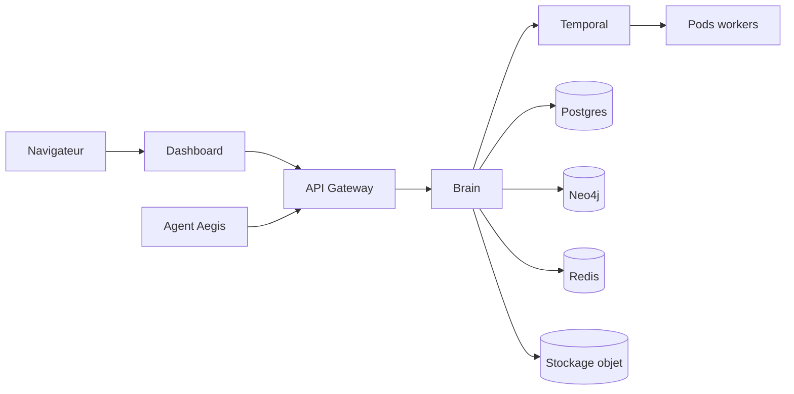

# Architecture infrastructure

Aegis s'exécute comme un ensemble de services Kubernetes. Le trafic public atteint le Dashboard et la Gateway; les services backend communiquent via endpoints internes et gRPC.

## Principes

- Limiter l'ingress public aux composants nécessaires.
- Attacher l'identité tenant à chaque opération backend.
- Utiliser secrets/config maps au lieu d'identifiants codés en dur.
- Traiter les workers comme des unités isolées et remplaçables.
