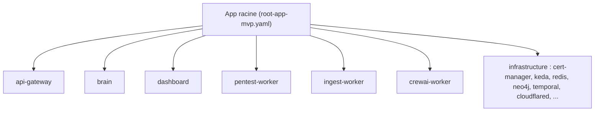

# GitOps & Argo CD

Le cluster Aegis est déployé en **GitOps** : Argo CD réconcilie en continu le
cluster vers l'état déclaré dans `Aegis-AI-Infra`. Tout changement fusionné sur la
ref suivie est synchronisé automatiquement.

## App-of-Apps

Une unique **application racine** possède l'environnement et crée une application
enfant par service et par composant d'infrastructure partagé.



## Structure du dépôt

```text
kubernetes/
  bootstrap/
    root-app-mvp.yaml        # Application racine Argo CD pour l'environnement MVP
  charts/
    aegis-service/           # Chart Helm universel utilisé par chaque service
  envs/
    mvp/
      api-gateway/           # application.yaml + values.yaml
      brain/
      dashboard/
      pentest-worker/
      ingest-worker/
      crewai-worker/          # Image de release Agent Crew épinglée
      infrastructure/
        cert-manager/        # TLS / mTLS automatisés
        keda/                # Autoscaling événementiel
        ...
scripts/
  setup-env.sh               # Amorce un environnement complet
  generate-brain-certs.sh    # Génération de certificats mTLS
  teardown-env.sh            # Nettoyage du cluster
```

Chaque dossier de service contient un `application.yaml` Argo CD et un
`values.yaml`. La configuration runtime réside dans `values.yaml` et les secrets
Kubernetes — jamais dans Git.

## Stack technique

| Composant          | Technologie              | Version                |
| ------------------ | ------------------------ | ---------------------- |
| Orchestration      | Kubernetes               | 1.28+                  |
| GitOps             | Argo CD                  | stable                 |
| Autoscaling        | KEDA                     | 2.x                    |
| Certificats        | cert-manager             | 1.x                    |
| Ingress            | Nginx Ingress Controller | —                      |
| Moteur de workflow | Temporal                 | Helm 0.x               |
| Base de données    | PostgreSQL (Bitnami)     | 16                     |
| Runtime sandbox    | gVisor (`runsc`)         | namespaces `sandbox-*` |

## Amorcer l'environnement MVP

```bash
# Depuis la racine du dépôt Aegis-AI-Infra
./scripts/setup-env.sh mvp

# Accéder à l'UI Argo CD
kubectl port-forward svc/argocd-server -n argocd 8080:443
# → https://localhost:8080  (user : admin)

# Récupérer le mot de passe admin initial
kubectl -n argocd get secret argocd-initial-admin-secret \
  -o jsonpath="{.data.password}" | base64 -d && echo
```

L'accès HTTPS public au MVP passe par un **tunnel Cloudflare** (`cloudflared`)
vers le reverse proxy in-cluster, puis vers l'ingress Nginx.

## Opérations courantes

```bash
kubectl get applications -n argocd
kubectl get pods -n aegis-system
kubectl logs -n aegis-system deploy/aegis-api-gateway
```

## Règles de fonctionnement

- Git est la source de vérité ; ne pas faire de `kubectl apply` à la main dans les
  environnements gérés par Argo CD.
- Garder les secrets dans des secrets Kubernetes, peuplés par
  `scripts/setup-env.sh` depuis un `.env` local, non commité.
- Privilégier des changements additifs à `values.yaml` ; revoir les changements
  cassants sur les services dépendants.
