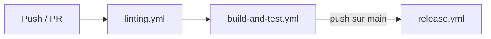
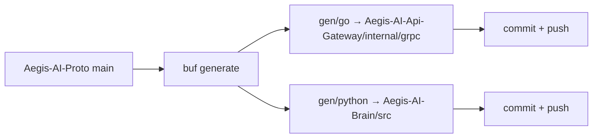
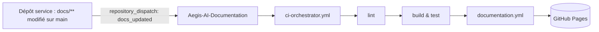

# Pipeline CI/CD

Chaque dépôt Aegis exécute le même pipeline de workflows réutilisables sur GitHub
Actions. Le déploiement vers Kubernetes n'est pas fait directement par la CI — la
CI publie des artefacts et **Argo CD** réconcilie le cluster depuis Git (voir
[GitOps & Argo CD](../Infra/gitops-argocd.md)).

## Pipeline par dépôt

`ci-orchestrator.yml` enchaîne trois workflows réutilisables :

| Étape         | Workflow              | S'exécute                | Objectif                                              |
| ------------- | --------------------- | ----------------------- | -------------------------------------------------- |
| Lint          | `linting.yml`         | chaque push / PR         | Linters de langage, formatage, hooks `pre-commit`   |
| Build & Test  | `build-and-test.yml`  | après le lint            | Compilation, tests unitaires/intégration, couverture |
| Release       | `release.yml`         | push sur `main` seulement | Build et publication de l'image / artefact           |

Les runners sont éphémères et les tokens à portée restreinte (`contents`,
`packages`, `pages`, `id-token` selon le besoin).

## Synchronisation des contrats — `proto-sync.yml`

`Aegis-AI-Proto` possède tous les contrats gRPC. À chaque push sur `main` (ou
`dev`) :

- `buf generate` produit les stubs Go et Python.
- Le workflow clone `Aegis-AI-Api-Gateway` et `Aegis-AI-Brain`, y copie le code
  généré, exécute les hooks `pre-commit` de chaque dépôt sur les fichiers modifiés
  (en sautant `golangci-lint` sur le Go généré), et commite
  `[UPDATE] gRPC code sync from Aegis-AI-Proto` si quelque chose a changé.
- Le bloc `ValidateProtobufRuntimeVersion` des fichiers Python `_pb2.py` est
  retiré pour la compatibilité inter-runtime.

## Synchronisation de la documentation — `docs-sync.yml`

Chaque dépôt de service surveille `docs/**` et `README.md` sur `main` :

- Une étape `peter-evans/repository-dispatch` émet l'événement `docs_updated` vers
  `Aegis-AI-Documentation` avec un PAT d'organisation.
- Le `ci-orchestrator.yml` de la Documentation s'exécute aussi sur ses propres
  push vers `main`.
- `documentation.yml` exécute `npm ci`, `npm run gen-api-docs`, `npm run build`
  (qui effectue les fetches remote-content), puis déploie `./build` sur **GitHub
  Pages** avec `contents: read`, `pages: write`, `id-token: write`.

## Passage au déploiement

Les images de release arrivent dans le registre de conteneurs. `Aegis-AI-Infra`
référence les tags d'image dans les `values.yaml` par service ; **Argo CD**
(App-of-Apps) synchronise le cluster vers cet état Git. Aucun `kubectl apply`
depuis la CI.

## Automatisation partagée — `aegis-automation.yml`

Présent dans chaque dépôt pour les tâches de maintenance à l'échelle de
l'organisation (alignement de branches, métadonnées, entretien). Il est
orthogonal au chemin build/test/release ci-dessus.
