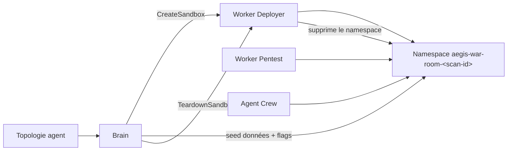

# Jumeau numérique & cibles de test

Aegis n'exécute jamais de trafic offensif contre la production du client. Chaque
scan cible un **jumeau numérique** : une réplique isolée et jetable construite à
partir de la topologie découverte par l'agent.

## Pourquoi un jumeau

- L'exploitation, l'extraction de loot et les payloads pilotés par LLM comportent
  un risque. Les exécuter contre une réplique supprime toute question de rayon
  d'impact.
- Le jumeau est reproductible : un scan peut être rejoué et comparé.
- Le jumeau est peu coûteux à détruire : chaque scan repart propre.

## Cycle de vie

1. **Construction** — le [Worker Deployer](../Worker-Deployer/quickstart.md) rend
   workloads, services, egress default-deny et services mock DNS/HTTP externes dans
   `aegis-war-room-<scan-id>`.
2. **Seed** — Brain peuple les bases de données avec des données réalistes et des
   flags connus (ex. `aegis-flag-1234`) pour que l'exfiltration soit prouvable.
3. **Attaque** — le [Worker Pentest](../Worker-Pentest/architecture.md) et l'[Agent
   Crew](../Agent-Crew/architecture.md) ne sondent que les endpoints internes à ce
   namespace.
4. **Teardown** — le namespace est supprimé ; le Deployer refuse de supprimer tout
   ce qui n'est pas préfixé `aegis-war-room-`.

## `vuln-app` — la fixture vulnérable canonique

Le dépôt `vuln-app` est une application Flask volontairement vulnérable minimale
(`python:3.9-slim`, écoute sur le port `80`) servant à valider tout le pipeline de
pentest de bout en bout. Elle est **réservée aux tests** et ne doit jamais être
exposée publiquement.

| Route      | Méthode | Comportement                                                            |
| ---------- | ------- | ------------------------------------------------------------------- |
| `/`        | `GET`   | Bannière statique (`Vulnerable Mock App`).                              |
| `/search`  | `GET`   | **Simulacre d'injection SQL.** Si `q` contient une apostrophe, renvoie toute la table utilisateur factice (`results`, `count`, `status: success`) — un signal déterministe sur lequel le scanner peut s'appuyer. |
| `/reflect` | `GET`   | **XSS réfléchie.** Renvoie `q` directement dans le corps HTML sans échappement. |
| `/health`  | `GET`   | Sonde de readiness `{"status": "ok"}`.                                  |

La table utilisateur factice contient de faux enregistrements `admin` / `user`
avec des hashs de mot de passe MD5 : un « exploit » réussi produit donc du loot
vérifiable sans aucun secret réel.

## Relation avec les fixtures du Deployer

Le dépôt du Deployer fournit une fixture plus riche
(`examples/sandbox-topology.vulnerable-webapp.json`) qui relie une web app
vulnérable à un StatefulSet PostgreSQL avec ordre de dépendance et un mock de
paiement externe. `vuln-app` est la variante légère pour les vérifications
locales rapides ; la fixture du Deployer est la forme de sandbox la plus proche du
réel. Voir [Deployer · Quickstart](../Worker-Deployer/quickstart.md).
