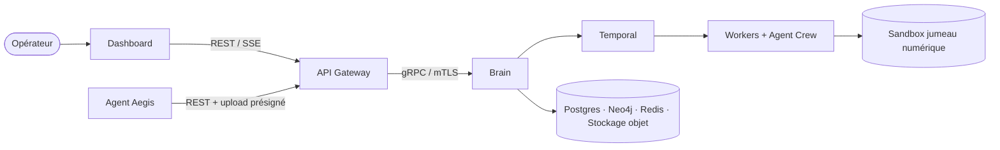

# Aegis AI — Introduction

Aegis AI est un **plan de contrôle de sécurité offensive** : une plateforme qui
cartographie en continu l'infrastructure d'un client, exécute des tests
d'intrusion automatisés et assistés par LLM contre une **réplique isolée** de
cette infrastructure, puis transforme les vulnérabilités confirmées en
propositions de remédiation.

La plateforme est un ensemble de microservices spécialisés qui communiquent en
gRPC derrière une unique façade REST/SSE. Ce portail est la source de vérité
architecturale pour l'ensemble de ces services.

## Le problème

Le pentest traditionnel est périodique, manuel et coûteux. Entre deux missions,
l'infrastructure dérive : de nouveaux services sont exposés, les dépendances
vieillissent, la configuration change. Aegis AI vise cet écart avec un système
qui :

- maintient un modèle vivant de la topologie client grâce à un agent léger ;
- lance des workflows de pentest reproductibles, à la demande ou planifiés ;
- combine des tests de vulnérabilités déterministes et de la génération de
  payloads pilotée par LLM ;
- exécute chaque action offensive contre un **jumeau numérique isolé**, jamais
  contre le système de production ;
- produit des rapports appuyés par des preuves et des correctifs de remédiation.

## Le fonctionnement, en un paragraphe

Une organisation cliente est intégrée (onboarding) et reçoit un **token de
déploiement** à usage unique. Un **Agent** (Rust) est installé sur son
infrastructure ; il s'enregistre via l'**API Gateway** (Go), puis diffuse la
topologie et des heartbeats. Depuis le **Dashboard** (React), un opérateur lance
un scan. Le **Brain** (Python) orchestre le scan sous forme de workflow
**Temporal** durable : il demande au **Worker Deployer** de construire une
réplique sandbox, exécute le **Worker Pentest** et l'**Agent Crew** (CrewAI)
contre elle, persiste vulnérabilités et preuves, stocke un graphe de topologie
dans **Neo4j** et génère un rapport PDF. Les vulnérabilités confirmées peuvent
être transmises au **Worker Fixer** pour des propositions de remédiation. Tout
est cloisonné au tenant du client et mesuré via un ledger de tokens.

## Contexte du projet

Aegis AI est un **EIP (Epitech Innovative Project)**, identifié `AEGIS-CORE-2026`.
C'est un système polyglotte multi-dépôts (Go, Python, Rust, TypeScript) déployé
sur Kubernetes avec un pipeline GitOps.

## Où aller ensuite

| Vous voulez…                                     | Lire                                                          |
| ------------------------------------------------ | ------------------------------------------------------------- |
| Comprendre la carte complète des composants      | [Architecture système](./system-architecture.md)              |
| Suivre un scan du clic au rapport                | [Cycle de vie de bout en bout](./lifecycle.md)                |
| Savoir quel dépôt fait quoi                      | [Dépôts](./repositories.md)                                   |
| Comprendre le modèle de confiance et d'isolation | [Modèle de sécurité](./security-model.md)                     |
| Chercher un terme                                | [Glossaire](./glossary.md)                                    |
| Vérifier ce qui est implémenté aujourd'hui       | [Statut du projet](./project-status.md)                       |
| Déployer la plateforme                           | [Infrastructure · Démarrage](../Infra/getting-started.md)     |
| Appeler l'API publique                           | [Référence API](../Swagger-API/aegis-ai-gateway-api.info.mdx) |
