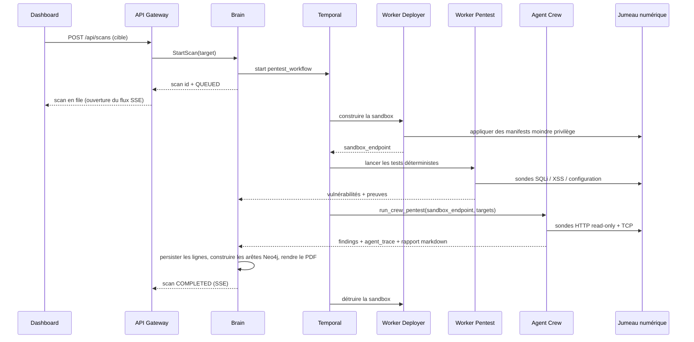

# Cycle de vie de bout en bout

Cette page suit un client depuis l'onboarding jusqu'à une vulnérabilité remédiée,
et nomme le service responsable de chaque étape.

## 1. Onboarding de l'entreprise

1. Un admin Aegis (ou le flux d'onboarding post-paiement) crée l'entreprise, son
   utilisateur owner et un **token de déploiement** à usage unique — de manière
   atomique, dans le Brain.
2. L'owner reçoit une invitation et active son compte via
   `POST /api/auth/setup-password`. La réponse renvoie le token de déploiement en
   clair **une seule fois** ; seul son hash SHA-256 est stocké.
3. Le Brain écrit une entrée d'audit pour la création.

## 2. Déploiement de l'agent

1. L'owner installe l'**Agent Aegis** (Docker, systemd ou DaemonSet Helm) avec
   `DEPLOYMENT_TOKEN` défini.
2. Au premier démarrage, l'agent appelle `POST /api/agents/register`. La Gateway
   transmet `RegisterAgent(token, name)` au Brain, qui valide le hash du token,
   crée une ligne `Agent` liée à l'entreprise et renvoie `agent_id` +
   `agent_secret`.
3. L'agent persiste le secret localement et s'authentifie avec lui ensuite.
4. L'agent envoie des heartbeats `RUNNING` à `POST /api/agents/{id}/status` ; le
   Brain met à jour `last_seen`. Le Dashboard lit `GET /api/agents/status` pour le
   résumé actifs/inactifs.

## 3. Collecte de la topologie

1. L'agent inspecte l'inventaire hôte, processus, conteneurs et Kubernetes selon
   les permissions disponibles.
2. Il demande une URL présignée à `GET /api/agents/{id}/upload-url` et fait un
   `PUT` du payload de topologie vers le stockage objet — sans identifiant de
   stockage permanent.
3. Le **Worker Ingest** normalise les payloads en enregistrements backend ; le
   Brain projette la topologie dans le graphe **Neo4j**.

## 4. Orchestration du scan

Points clés :

- Le workflow est **durable** : Temporal le rejoue à travers les redémarrages de
  pods, un worker planté ne perd donc pas l'état du scan.
- Les activités sont **idempotentes** : les retries ne dupliquent jamais les
  données du tenant.
- L'**Agent Crew** exécute trois agents adossés à Ollama — `Planner`
  (llama3.1:8b), `Guider` (whiterabbitneo), `Executor` (deepseek-coder-v2) — et
  est **non destructif en V1** : il valide les `constraints` et échoue avant tout
  appel modèle si un comportement destructif est demandé.
- Le trafic offensif n'atteint que le **jumeau numérique construit par le
  Deployer**, jamais la production du client.

## 5. Résultats et rapport

1. Le Brain stocke les lignes `Scan`, `Vulnerability` et `Evidence` (loot en
   JSONB).
2. Il relie assets et vulnérabilités dans Neo4j pour l'analyse de chemins
   d'attaque et d'impact.
3. Il rend un rapport PDF exposé via `GET /api/scans/{id}/report`.
4. Le Dashboard diffuse le statut en direct via `GET /api/scans/{id}/stream` et
   liste les vulnérabilités dans le Vault.

## 6. Remédiation

1. Une vulnérabilité confirmée et son contexte sont transmis au **Worker Fixer**.
2. Le Fixer produit une **proposition de correctif**, en privilégiant des
   changements style pull request plutôt qu'une mutation directe, et enregistre
   acteur, tenant, finding et changement généré.
3. Rien n'est appliqué automatiquement ; la validation reste à l'opérateur via le
   Dashboard.

## 7. Mesure et audit

- Les opérations consommatrices de tokens sont débitées du solde de l'entreprise
  et inscrites au **ledger de facturation** (`GET /api/billing/ledger`,
  `/balance`, `/stats`).
- Les actions d'administration et de gestion de tokens sensibles produisent des
  entrées d'**audit log** (`GET /api/admin/audit-logs`).
