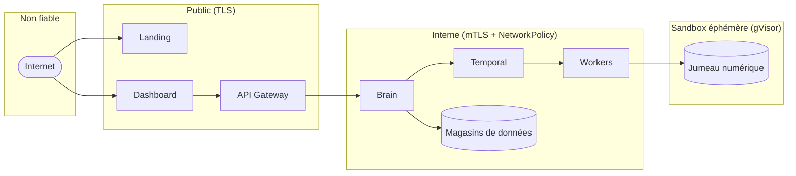

# Modèle de sécurité

Les contrôles de sécurité d'Aegis AI sont en couches. Aucun contrôle n'est jugé
suffisant seul ; chacun suppose que les autres peuvent échouer.

## Frontières de confiance

## Identité et authentification

| Acteur              | Identifiant                          | Durée de vie / traitement                                            |
| ------------------- | ---------------------------------- | ------------------------------------------------------------------- |
| Opérateur (user)    | Access token JWT                   | Courte durée, conservé en mémoire dans le frontend.                  |
| Session opérateur   | Refresh token                     | Cookie HTTP-only, tourné à chaque refresh, révocable côté serveur.   |
| Agent (enregistrement) | Token de déploiement `ag_<43+ car.>` | Usage unique, par entreprise ; seul le hash SHA-256 est stocké.  |
| Agent (runtime)     | Secret agent                      | Par agent ; haché bcrypt côté serveur ; renvoyé une fois à l'enregistrement. |
| Gateway → Brain     | Certificat client mTLS            | Monté depuis des secrets Kubernetes sous `/etc/brain/certs`.        |
| Token interne       | Vérification `InternalAuthService`| Whitelist d'intercepteur gRPC pour les contrôles machine à machine. |

Tourner ou révoquer un token de déploiement ne **déconnecte pas** les agents déjà
enregistrés — ils continuent avec leur propre secret agent.

## Autorisation (RBAC)

Les rôles sont synchronisés entre le Brain et la Gateway :

| Rôle             | Côté        | Portée typique                        |
| ---------------- | ----------- | ----------------------------------- |
| `superadmin`     | Plateforme  | Administration de toute la plateforme |
| `admin`          | Plateforme  | Administration côté Aegis             |
| `billing_aegis`  | Plateforme  | Opérations de facturation plateforme  |
| `technicien`     | Plateforme  | Opérations de support technique       |
| `support`        | Plateforme  | Support et assistance client          |
| `commercial`     | Plateforme  | Opérations commerciales / comptes     |
| `owner`          | Client      | Owner de l'organisation cliente       |
| `billing_client` | Client      | Accès facturation client              |
| `operateur`      | Client      | Opérateur technique client            |
| `viewer`         | Client      | Accès client en lecture seule         |

Les rôles client ne peuvent jamais lire les scans ou agents d'une autre
entreprise ; les routes plateforme élevées exigent des scopes élevés explicites.

## Multi-tenancy

- Chaque ressource rattachée à un tenant porte un `company_id` : utilisateurs,
  agents et tokens, scans, vulnérabilités, preuves, rapports, entrées de
  facturation, audit logs.
- Le Brain ré-applique les filtres tenant à chaque lecture et mutation, même si la
  Gateway a déjà authentifié l'appelant.
- Les requêtes Neo4j qui matérialisent des données de graphe pour l'UI, les
  rapports ou les workers sont contraintes par le contexte entreprise.

## Isolation réseau et runtime

- Politiques réseau **default-deny** quand c'est praticable ; les namespaces de
  workers ne peuvent pas atteindre des services plateforme non liés ; les bases de
  données n'acceptent que les charges attendues.
- Les workers s'exécutent **non-root**, système de fichiers racine en lecture
  seule quand c'est possible, capabilities Linux retirées, limites de ressources,
  service accounts restreints.
- Les workers de sécurité peuvent s'exécuter sous la runtime class **gVisor
  (`runsc`)** dans des namespaces `sandbox-*`.
- Le HTTPS public est frontalé par l'ingress Nginx ; l'accès externe de production
  passe par un tunnel Cloudflare.

## Sûreté des actions offensives

- Le trafic offensif ne cible jamais que le **jumeau numérique provisionné par le
  Deployer**, jamais la production du client.
- L'Agent Crew est **non destructif en V1** : les actions autorisées sont HTTP
  read-only (`GET`/`HEAD`/`OPTIONS`), sondes de reachability TCP, analyse
  headers/réponses et génération de texte de patch. Modifier la sandbox, exécuter
  des commandes dans les pods cibles, écrire des ressources Kubernetes, appliquer
  des patchs et pousser des changements Git sont interdits ; le worker échoue
  avant tout appel modèle si les `constraints` le demandent.
- Une vulnérabilité n'est marquée **confirmée** qu'après validation déterministe,
  pas sur les affirmations du modèle. La preuve vient du worker, pas du modèle.

## Gestion des secrets et des données

- Secrets et configuration proviennent des secrets / config maps Kubernetes,
  jamais de Git.
- Les tokens de déploiement et secrets agent ne figurent jamais dans les payloads
  de télémétrie.
- Secrets, identifiants client, tokens et données privées brutes ne sont jamais
  envoyés à des fournisseurs de modèles externes ; le contexte de prompt est
  limité à des métadonnées techniques assainies.
- Les preuves sont assainies avant d'être rendues dans les rapports ou l'UI.

## Auditabilité

Les actions d'administration et de gestion de tokens sensibles écrivent des
entrées d'audit incluant l'acteur et le contexte entreprise, disponibles via
`GET /api/admin/audit-logs`.
