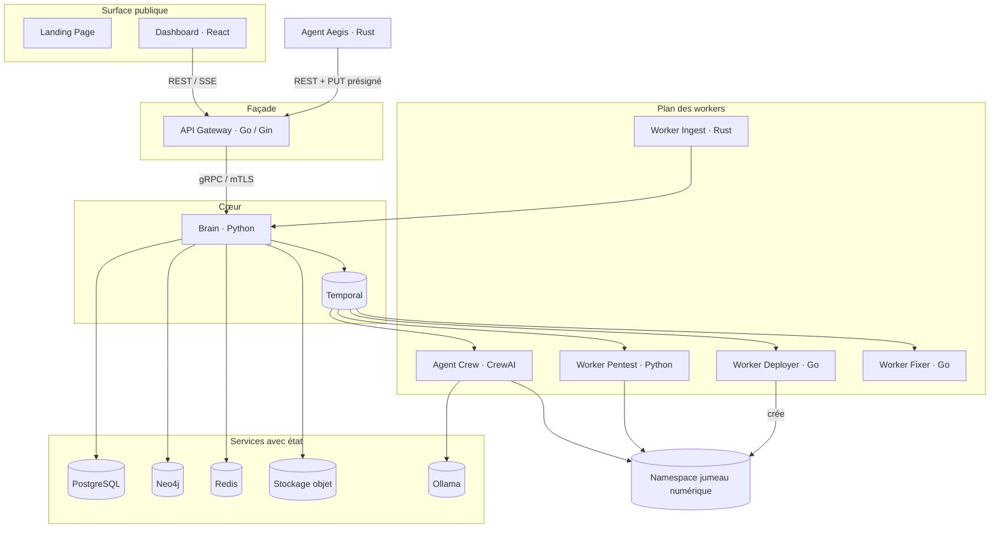

# Architecture système

Aegis AI est une plateforme de microservices événementielle sur Kubernetes. Le
trafic public entre par une façade unique (Dashboard + API Gateway). Toute la
logique métier réside dans le Brain, qui orchestre les workers via Temporal.
Chaque saut interne est authentifié.

## Composants

| Composant       | Langage / Stack         | Rôle                                                                                                |
| --------------- | ----------------------- | --------------------------------------------------------------------------------------------------- |
| Landing Page    | Next.js                 | Site marketing public. Aucun accès à l'état authentifié.                                            |
| Dashboard       | React 18 + Vite + Panda | Console opérateur : agents, scans, vulnérabilités, rapports, facturation, admin.                    |
| API Gateway     | Go 1.22 + Gin           | Façade REST/SSE, CORS, rate limiting, middleware JWT + auth agent, traduction REST↔gRPC.           |
| Brain           | Python 3.11 + asyncio   | Service métier gRPC, moteur de workflows Temporal, persistance, génération de rapports.             |
| Proto           | Protobuf + buf          | Source de vérité unique des contrats gRPC ; génère les stubs Go, Python et Rust.                    |
| Agent Aegis     | Rust                    | Sonde côté client : enregistrement, heartbeat, découverte de topologie, upload présigné.            |
| Worker Deployer | Go                      | Construit et détruit la sandbox jumeau numérique pour un scan.                                      |
| Worker Pentest  | Python + Scapy          | Tests de vulnérabilités déterministes (SQLi, XSS, …) et capture de preuves.                         |
| Agent Crew      | Python + CrewAI         | Worker Temporal coordonnant les agents LLM `Planner`, `Guider`, `Executor` (Ollama).                |
| Worker Ingest   | Rust                    | Normalise les lots de télémétrie agent en enregistrements backend.                                  |
| Worker Fixer    | Go                      | Transforme les vulnérabilités confirmées en propositions de remédiation (style PR, non destructif). |
| Infra           | Kubernetes + Argo CD    | Manifests GitOps, chart Helm `aegis-service`, network policies, cert-manager, KEDA.                 |

## Schémas de communication

| De → Vers                      | Protocole                    | Notes                                                                 |
| ------------------------------ | ---------------------------- | --------------------------------------------------------------------- |
| Navigateur → Gateway           | HTTPS REST + SSE             | Access token JWT ; refresh via cookie HTTP-only.                      |
| Agent → Gateway                | HTTPS REST + `PUT` présigné  | Token de déploiement pour l'enregistrement, puis secret agent.        |
| Gateway → Brain                | gRPC sur mTLS                | Certificat client validé ; identité tenant dans les métadonnées gRPC. |
| Brain → Temporal               | SDK Temporal                 | Workflows durables résistant aux redémarrages de pods.                |
| Temporal → Workers             | Files de tâches              | Une file par classe de worker (ex. `CREWAI_TASK_QUEUE`).              |
| Brain → PostgreSQL             | SQLAlchemy 2.0               | Toutes les données relationnelles rattachées au tenant.               |
| Brain → Neo4j                  | Bolt                         | Graphe de topologie et de chemins d'attaque.                          |
| Brain → Redis                  | RESP                         | Cache, rate limiting, état transitoire, diffusion SSE.                |
| Brain / Agent → Stockage objet | Compatible S3 (MinIO en dev) | Rapports, loot, payloads de topologie.                                |
| Agent Crew → Ollama            | HTTP                         | ClusterIP interne ; modèles jamais embarqués dans les images.         |

## Magasins de données

| Magasin        | Contient                                                                                                             |
| -------------- | -------------------------------------------------------------------------------------------------------------------- |
| PostgreSQL     | entreprises, utilisateurs, refresh tokens, agents, scans, vulnérabilités, preuves, ledger de facturation, audit logs |
| Neo4j          | hôtes, conteneurs, services, images, namespaces, vulnérabilités, preuves et leurs relations                          |
| Redis          | caches, compteurs de rate limiting, état du broadcaster SSE                                                          |
| Stockage objet | rapports PDF, payloads de preuves/loot, uploads de topologie agent                                                   |

## Principes de fonctionnement

- L'ingress public est limité à la Landing Page, au Dashboard, à l'API Gateway et
  aux endpoints de santé documentés.
- L'identité tenant (`company_id`) est attachée à chaque opération backend et
  revérifiée dans le Brain même si la Gateway a déjà authentifié la requête.
- La logique métier reste dans le Brain ; la Gateway reste fine et centrée sur les
  politiques.
- Les workers sont sans état, isolés et remplaçables ; ils ne reçoivent du travail
  que par l'orchestration backend.
- Le trafic offensif ne cible jamais que le jumeau numérique provisionné par le
  Deployer.
- La configuration et les secrets proviennent des secrets / config maps
  Kubernetes, jamais de Git.
